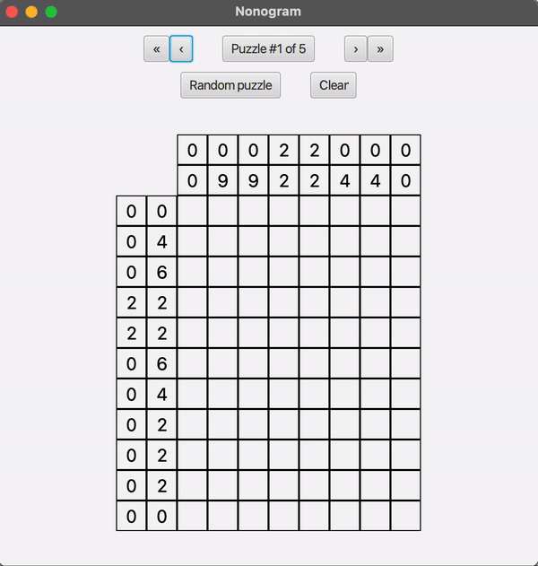

# Nonogram GUI using JavaFX
A simple GUI put together with JavaFX that allows a nonogram puzzle to be played. There are 5 pre-made puzzles in the application,
and each will give a pop-up window when the puzzle is solved. Tiles are shaded in with a mint green color, and right-clicking
creates a "X" symbol that the application will ignore when checking for the solution. There are also buttons to randomize the
puzzle selection and clear the board of existing shaded or "X" tiles.

This JavaFX application uses the **model-view-controller** design pattern to create a fully functional GUI implementation of a 
working nonogram puzzle. The main idea of this is to separate the application's UI code from the state management code.

### Running the Project / Viewing Demo
Included in this repository are a `.jar` package for reproduction and a `nonogram demo.gif` file to see the project's working
functionality. To use the `.jar` file, a version of the Java Runtime Environment (JRE) must already be installed.

## Project Structure
Within the `src` directory there are 3 main subdirectories, `controller`, `model`, and `view`, along with pre-made puzzles in
`PuzzleLibrary` as well as the starting point to the application `Main`. This is a summary of each of their functions:
* `Main` - the starting point of the application. This is what Maven uses to launch the application.
* `PuzzleLibrary` - a class that contains 5 pre-made puzzles for the application. It contains a class factory method, `create()`,
that instantiates and returns a singleton `List<Clues>` list of `Clues` objects.
* `model` - the purpose of the `model` is to encapsulate the application's state, exposing public methods to access and modify the state.
The `model` is an observable subject that lets the rest of the application know when the state is changed.
* `view` - the purpose of the 'view' is to encapsulate and generate the UI using current state values from the `model`. The `view` 
refreshes the UI when the application state changes, and this is done by observing the `model` (indirectly through the `controller`).
* `controller` - the job of the `controller` is to facilitate communication between the `model` and the `view`. It handles user 
interactions, such as clicking a tile, and calls `model` methods to change the application's state.

### Model
In this subdirectory, there are interfaces for the `Board`, `Clues`, the general `Model`, and the `ModelObserver` 
(which has an `update()` method to alert the UI side of the application). Each of these interfaces has their own respective 
implementation. All of these classes help represent the current state of the application.

### View
The `view` subdirectory contains an interface for a `FXComponent`, which is the basis for the more specific components `ControlView`,
`MessageView`, `PuzzleView`, and `View` to appear on screen. It also contains an `AppLauncher` class that initializes the
**model-view-controller** design by creating a scene and starting the stage.

### Controller
There is only one `Controller` interface in this subdirectory with its respective implementation, used to access and modify 
the current state of the puzzle.